# European Housing Prices Analysis
## Stakeholder Decision-Support Report
## Executive Summary

This analysis examines housing-price movements across European countries using quarterly housing-price data covering the period from 2022 Q4 to 2025 Q3, with some countries having shorter periods of coverage.
The primary purpose of the analysis is to identify countries experiencing the strongest and weakest housing-price growth, understand the broader European housing-price trend, compare housing-market performance between EU and non-EU countries and between Eurozone and non-Eurozone countries, and identify areas that may require further investigation by decision-makers.

The analysis shows that housing-price growth remained broadly positive across Europe in 2025 Q3. Hungary recorded the strongest year-on-year growth at 21.1%, followed by Portugal at 17.7% and Bulgaria at 15.4%. Finland was the only country with negative year-on-year growth, at -3.1%.
Looking at the longer-term change from the 2015 baseline, Hungary also recorded the strongest increase among countries with comparable 2025 Q3 data, at approximately 275.2%, followed by Portugal (169.4%), Iceland (165.1%), Lithuania (162.0%) and Bulgaria (156.0%).
The median housing-price index across individual countries increased from approximately 169.6 in 2022 Q4 to 191.8 in 2025 Q3, representing an increase of about 13% over the period.
EU countries recorded an average year-on-year growth of approximately 7.05% in 2025 Q3, compared with 4.60% among non-EU countries in the dataset. However, the data does not establish that EU membership caused higher housing-price growth.
The results indicate a European housing market characterized by substantial differences between countries. Some markets are experiencing very rapid price appreciation, while others are experiencing relatively weak growth or decline.
These findings can help stakeholders identify markets requiring closer monitoring, potential investment opportunities, affordability risks, and areas where additional economic or housing-market research is warranted.
________________________________________
# Objective / Aim of the Analysis
# The main objective of this analysis is:
To examine housing-price trends and differences across European countries in order to identify significant patterns, high-growth and low-growth markets, and information that can support evidence-based stakeholder decision-making.
# The analysis specifically seeks to understand:

•	How housing prices have changed over time.

•	Which countries are currently experiencing the strongest housing-price growth.

•	Which countries have experienced the greatest long-term price increases.

•	Whether housing-price performance differs between EU and non-EU countries.

•	Whether housing-price performance differs between Eurozone and non-Eurozone countries.

•	Which countries may require further investigation because of unusually high or low price growth.

In order to answer the analytical questions and provide insights, I followed the steps of the data analysis process: Ask, Prepare, Process, Analyze, Share, and Act.
________________________________________
# Approach

# i. Ask
# Analytical Questions

Six key questions were established before conducting the analysis.

Question 1

What is the overall trend in housing prices across the individual European countries in the dataset?

Question 2

Which countries have the highest year-on-year housing-price growth in the latest available quarter?

Question 3

Which countries have experienced the largest increase in housing prices relative to the 2015 baseline?

Question 4

How does housing-price growth compare between EU and non-EU countries?

Question 5

How does housing-price growth compare between Eurozone and non-Eurozone countries?

Question 6

Which countries currently show strong growth, moderate growth, or decline?

These questions were selected because they combine trend analysis, ranking, segmentation and decision-oriented comparison.
________________________________________
# ii. Prepare

Data Source: 

One csv dataset was used: 
European_housng_prices_clean.csv [https://www.kaggle.com/datasets/ibrahimshahrukh/european-housing-price-index-dataset]. This dataset has been made available by Ibrahim Shahruk under Creative Common Licenses [https://creativecommons.org/licenses/by-nc-sa/4.0/].

# Dataset Overview

The dataset contains 417 observations across 12 variables.

The principal variables include:

country - (Country or European aggregate series)

country_type - (Identifies individual countries versus aggregate series)

eu_member - (EU membership indicator)

eurozone_member - (Eurozone membership indicator)

year - (Observation year)

quarter_num - (Numeric quarter)

quarter - (Quarter label)

price_index - (Housing-price index)

quarterly_change_pct - (Quarterly percentage change)

yearly_change_pct - (Year-on-year percentage change)

price_change_since_2015_pct - (Change relative to the 2015 baseline)

data_quality - (Data-quality/coverage information)

The dataset contains 30 individual countries and 5 European aggregate series.

For country-level analysis, the aggregate series were excluded because an aggregate such as "European Union" or "Euro area"

should not be treated as an individual country.
________________________________________
# iii. Process

Tools Used:

Excel/Spreadsheet: For data cleaning, transformation, analysis, and creating visual dashboard.

GitHub: For version control and project ocumentation

Data Preparation and Cleaning

Before analysis, the dataset was examined for completeness, consistency and analytical suitability.

Duplicate check

No exact duplicate rows were identified.

Therefore, no duplicate records needed to be removed.

Country versus aggregate observations

The country column contains both individual countries and European aggregate series.

This was important because including the European Union or Euro area as if they were countries would distort country rankings and averages.

A classification field was therefore created to distinguish:

•	Individual country

•	European aggregate

Country-level analysis was restricted to individual countries.

Missing EU and Eurozone membership

The EU and Eurozone membership fields contain blanks for the aggregate European series.

These blanks were not converted to "No" because the membership fields are not applicable to aggregate observations.

Switzerland missing price-index values

Switzerland has missing price_index values for the available period from 2022 Q4 through 2025 Q3.
The missing values were not artificially estimated or filled because doing so could introduce unsupported assumptions into the analysis.
The dataset itself flags these observations as having a missing price index.

Türkiye coverage limitation

Türkiye has fewer observations than most other countries, with available observations ending in 2024 Q4.
Türkiye was not deleted from the dataset because the observations are still valid and analytically useful.
However, Türkiye was excluded from direct 2025 Q3 comparisons because it does not have a 2025 Q3 observation.

Latest-quarter comparison

The latest quarter in the dataset is 2025 Q3.

For current-country comparisons, the analysis therefore used the latest available observations while clearly identifying countries that did not have 2025 Q3 data.
________________________________________
Analytical Methodology

The analysis followed a structured data-analysis workflow.

Step 1 — Data understanding

The dataset structure, variables, observation period and country coverage were examined.

Step 2 — Data-quality assessment

The data was checked for:

•	Duplicate records

•	Missing values

•	Inconsistent classifications

•	Country versus aggregate observations

•	Incomplete country coverage

•	Availability of the price index

Step 3 — Data cleaning

The dataset was prepared for analysis by:

•	Separating individual countries from European aggregates.

•	Retaining valid observations with missing values rather than deleting them unnecessarily.

•	Documenting missing data.

•	Identifying the latest available quarter.

•	Creating analytical helper fields.

Step 4 — Data wrangling

Additional analytical fields were created, including:

•	Analysis group

•	Latest-observation flag

•	Price-index availability

•	Growth category

For example, year-on-year growth was classified as:

•	Decline: below 0%

•	Moderate Growth: 0% to below 5%

•	Strong Growth: 5% or higher

These are analytical categories created for this project rather than categories supplied by the original dataset.

# iv. Analyze

Step 5 — Exploratory Data Analysis

Descriptive statistics and comparisons were used to identify:

•	Overall trends

•	Rankings

•	Outliers

•	Differences between groups

•	High-growth and low-growth countries

Step 6 — Comparative analysis

The analysis compared:

•	Countries against one another.

•	EU versus non-EU countries.

•	Eurozone versus non-Eurozone countries.

•	Current growth versus longer-term growth.

Step 7 — Visualization

Charts were selected according to the analytical question.

Examples include:

•	Line chart for price-index trends.

•	Horizontal bar chart for country rankings.

•	Comparison charts for EU/Eurozone groups.
________________________________________
# Key Findings and Insights

Finding 1 — European housing prices show an overall upward trend

The median price index across individual countries increased from approximately:
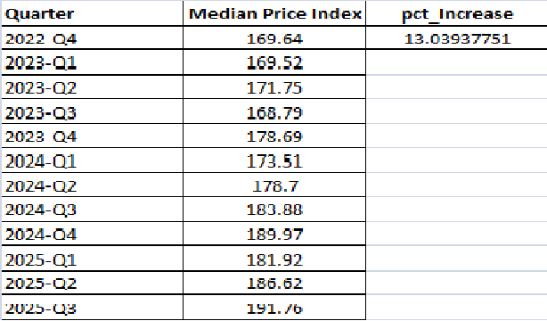 

169.64 in 2022 Q4
to
191.76 in 2025 Q3.

This represents an increase of approximately 13% in the median price index over the observed period. That is ((Ending – Beginning) / Beginning)) x 100 = ((191.76 – 169.64) / 169.64) x 100 = 13%.
The overall direction therefore suggests that housing prices generally increased across the countries represented in the dataset, although individual markets behaved differently.

Stakeholder implication

The European housing market should not be treated as a single uniform market. The overall upward trend hides substantial differences between individual countries.
Decision-makers should therefore combine the European-level trend with country-level analysis before making investment, policy or market-entry decisions.
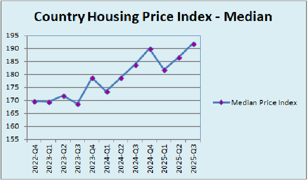 

________________________________________
Finding 2 — Hungary had the strongest latest annual growth

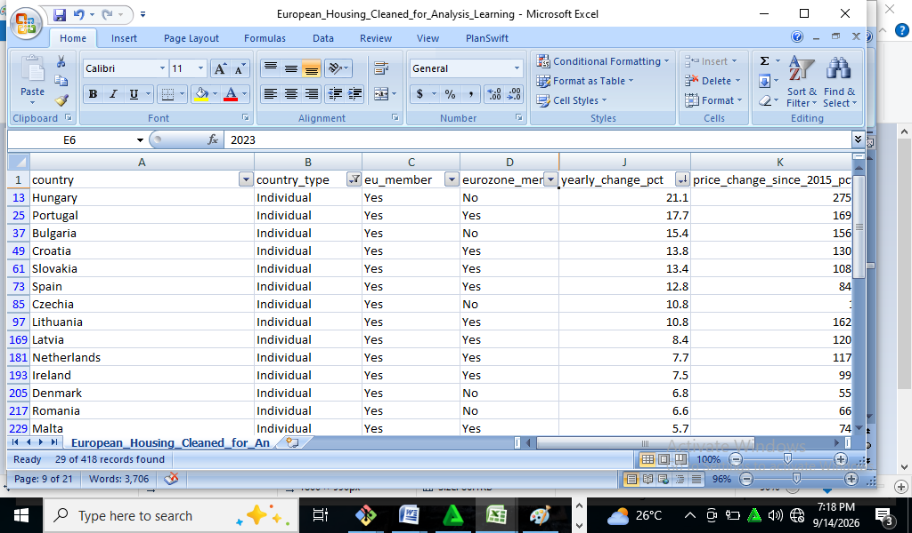 

In 2025 Q3, Hungary recorded the highest year-on-year housing-price growth at:
21.1%

The next highest were:

Rank	Country	 Year-on-year growth

1	   Hungary	    21.1%

2	   Portugal	   17.7%

3	   Bulgaria	   15.4%

4	   Croatia	    13.8%

5	   Slovakia	   13.4%

6	   Spain	      12.8%

7	   Lithuania  	10.8%

8	   Czechia	    10.8%

9	   Latvia	     8.4%

10	  Netherlands	7.7%

The results demonstrate considerable variation in current housing-market performance.

Stakeholder implication

Markets with exceptionally high growth deserve closer investigation.
High growth can indicate strong demand and potential investment opportunities, but it can also indicate affordability pressure and the possibility that prices are increasing faster than underlying economic fundamentals.
The growth figure alone should therefore not be interpreted as a recommendation to invest.

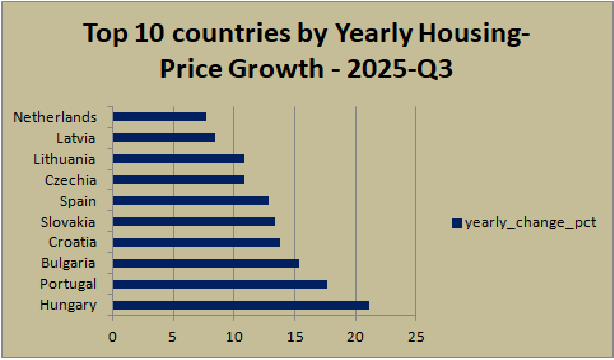 
________________________________________
Finding 3 — Finland was the only country with negative latest annual growth

In 2025 Q3:

•	28 of the 29 countries with available year-on-year observations recorded positive growth.

•	Finland recorded the only negative year-on-year change, at -3.1%.
 
This makes Finland a notable outlier in the latest-period comparison.

Stakeholder implication

Finland warrants further investigation to determine whether the decline reflects:

•	Local housing-market conditions.

•	Changes in demand.

•	Economic conditions.

•	Interest-rate effects.

•	Regional differences.

•	Temporary market weakness.

The dataset itself cannot establish which factor caused the decline.

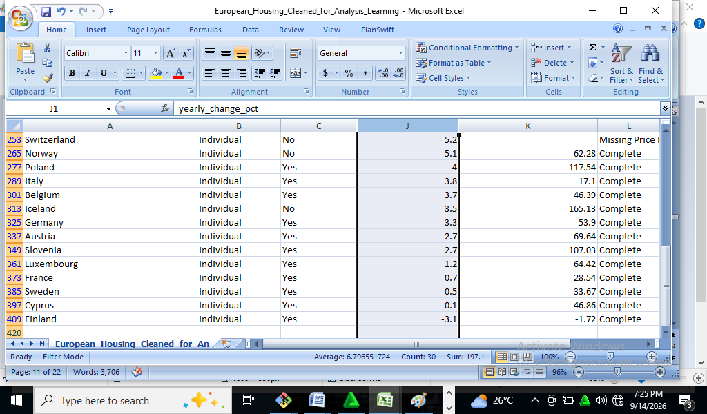
________________________________________
Finding 4 — Long-term housing-price growth varies dramatically across countries

Using the change relative to the 2015 baseline, Hungary recorded the largest increase among countries with comparable 2025 Q3 data:

Hungary: +275.2%

Other leading countries were:
 
Rank	Country	   Change since 2015

1	   Hungary	    275.2%

2	   Portugal	   169.4%

3	   Iceland	    165.1%

4	   Lithuania  	162.0%

5	   Bulgaria	   156.0%

6	   Czechia	    149.0%

7	   Croatia	    130.1%

8	   Estonia    	122.0%

9	   Latvia	     120.7%

10	  Netherlands	117.6%

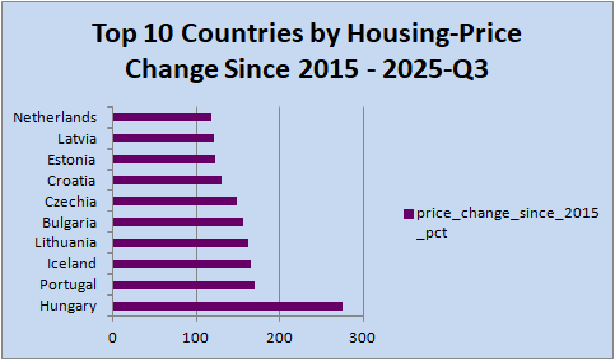

Türkiye shows an extremely large reported increase of approximately 1,784.9%, but its latest observation is 2024 Q4 rather than 2025 Q3. It should therefore not be directly ranked alongside the countries with 2025 Q3 observations when making a current-market comparison.
Switzerland cannot be ranked on this measure because its relevant price-index values are missing.
Stakeholder implication
Long-term growth highlights markets that have undergone substantial structural price appreciation.
However, historical growth should not automatically be interpreted as future growth potential.
A market that has already experienced very large appreciation may also face affordability constraints or changing demand conditions.
________________________________________
Finding 5 — EU countries showed higher average latest-period growth than non-EU countries

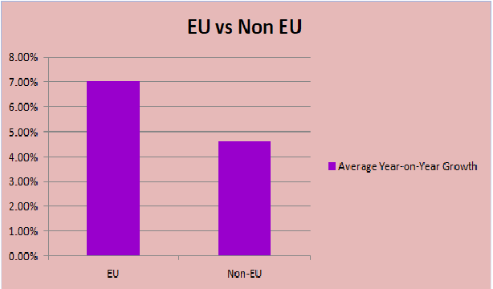

At 2025 Q3:

•	EU countries: approximately 7.05% average year-on-year growth

•	Non-EU countries: approximately 4.60% average year-on-year growth

The median values were:

•	EU: 6.15%

•	Non-EU: 5.10%

Both measures point in the same general direction: EU countries in this dataset had somewhat stronger average latest-period housing-price growth.

Important interpretation

This is an association, not proof that EU membership causes higher housing-price growth.

The comparison does not control for:

•	Interest rates

•	Income growth

•	Housing supply

•	Population changes

•	Inflation

•	Government policy

•	Mortgage availability

•	Urbanization

•	Construction activity

Therefore, no causal conclusion should be drawn from this comparison alone.
________________________________________
Finding 6 — Eurozone membership does not show the same simple pattern

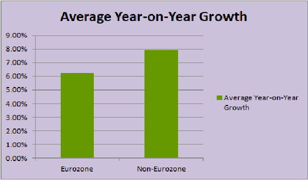 

At 2025 Q3:

•	Eurozone countries had approximately 6.23% average year-on-year growth.

•	Non-Eurozone countries had approximately 7.90% average year-on-year growth.

The median values were:

•	Eurozone: 5.2%

•	Non-Eurozone: 5.9%

Therefore, in this dataset, non-Eurozone countries actually recorded higher average and median latest-period growth.

Stakeholder implication

This demonstrates why analysts should avoid assuming that a broad regional or institutional classification automatically determines market performance.

Country-specific conditions appear to be highly important.
________________________________________
Growth Classification

Using the analytical thresholds established for this project:

•	Decline: below 0%

•	Moderate Growth: 0% to below 5%

•	Strong Growth: 5% or higher

The 2025 Q3 country observations were classified as follows:

Category	          Number of countries

Decline	            1

Moderate Growth	    11

Strong Growth	      17

Therefore, the majority of countries were classified as experiencing strong annual housing-price growth under the project's definition.
This reinforces the finding that the latest period was characterized by broadly positive housing-price movement.

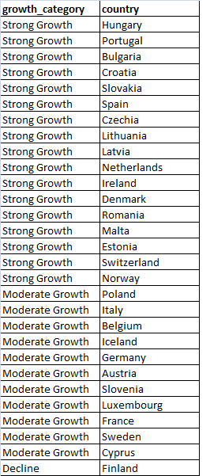 
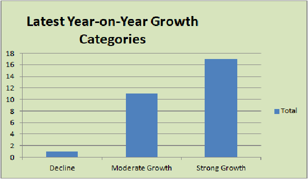 
________________________________________
# iv. Share
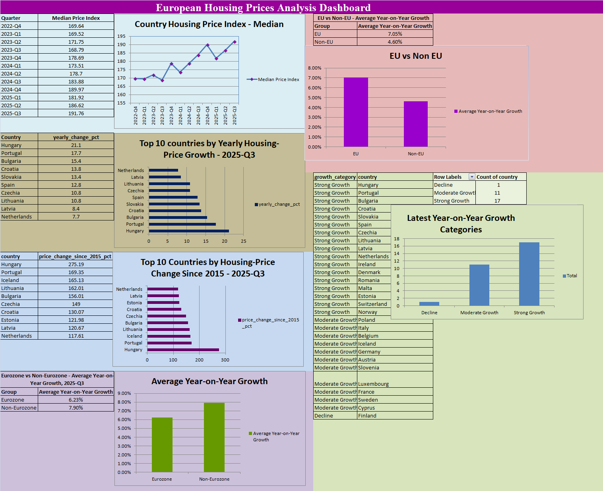

What the Findings Mean for Stakeholders

The analysis produces several decision-relevant messages.

The European housing market is heterogeneous

There is no single "European housing market" behaving uniformly.

Countries are experiencing substantially different levels of price growth.

Rapid growth deserves both opportunity and risk analysis

Countries such as Hungary, Portugal and Bulgaria stand out because of strong recent growth.

For investors, these markets may warrant further investigation.

For policymakers, however, rapid growth may also indicate increasing affordability pressure.

Weak-growth markets should not automatically be considered unattractive
   
A country with low price growth may have:

•	Better affordability.

•	Lower investment risk.

•	Different rental-market characteristics.

•	Greater future growth potential.

Therefore, price growth should be considered alongside other indicators.

Historical performance should not be treated as a forecast

The large increases recorded by some countries since 2015 demonstrate what has happened historically.

They do not establish what will happen next.

Data quality matters for decision-making

Switzerland's missing price-index data and Türkiye's shorter time coverage demonstrate why stakeholders should always understand the limitations behind a dashboard or ranking.
________________________________________
# v. Act

## Recommendations
    
Based on the findings, the following recommendations are appropriate.

Recommendation 1 — Investigate high-growth markets further

Stakeholders considering investment or market expansion should conduct deeper analysis of countries such as:

•	Hungary

•	Portugal

•	Bulgaria

•	Croatia

•	Slovakia

•	Spain

The next stage should examine whether high price growth is supported by fundamentals such as income, population, housing supply, rents and economic activity.

Recommendation 2 — Monitor affordability risk

Markets experiencing very rapid price appreciation should be assessed for affordability pressure.

A useful follow-up analysis would compare:

House-price growth versus income/wage growth.

If housing prices are rising substantially faster than incomes, affordability risks may be increasing.

Recommendation 3 — Investigate Finland's decline

Finland's negative latest annual growth makes it an important market for further investigation.

Stakeholders should determine whether the decline is temporary or part of a longer-term trend.

Recommendation 4 — Do not make investment decisions from price growth alone

A high-growth market should not automatically be classified as a "buy."

Investment decisions should incorporate:

•	Rental yields

•	Mortgage rates

•	Income levels

•	Population growth

•	Housing supply

•	Vacancy rates

•	Construction activity

•	Economic growth

•	Regulatory conditions

•	Taxation

•	Currency considerations

Recommendation 5 — Improve data coverage before high-stakes decisions

Before using this analysis for a major investment or policy decision, the dataset should ideally be supplemented with:

•	More recent observations.

•	Complete Swiss price-index data.

•	More historical observations.

•	Income data.

•	Rent data.

•	Mortgage/interest-rate data.

•	Housing supply and construction data.

•	Population and migration data.

Recommendation 6 — Build a recurring housing-market dashboard

Rather than conducting the analysis only once, stakeholders could establish a quarterly monitoring dashboard.

The dashboard should track:

1.	Current annual price growth.
   
2.	Quarterly price growth.
   
3.	Long-term price appreciation.
   
4.	Affordability.
   
5.	Rental yields.
    
6.	Housing supply.
    
7.	Interest rates.
    
8.	Country ranking changes.

This would turn the analysis from a one-time report into an ongoing decision-support system.
________________________________________
## Limitations of the Analysis

The following limitations should be explicitly communicated to stakeholders.

Limited time period

Most countries have observations covering approximately 2022 Q4 to 2025 Q3, which is relatively short for understanding long-term housing-market cycles.

Unequal country coverage

Türkiye has a shorter observation period and does not have a 2025 Q3 observation.

Missing Swiss price-index data

Switzerland cannot be fully compared on price-index-based measures because the relevant index observations are missing.

Descriptive rather than causal analysis

The analysis identifies relationships and patterns.

It does not demonstrate that EU membership, Eurozone membership or any other variable caused housing-price movements.

No economic drivers included

The dataset primarily describes housing-price movements.

It does not contain enough information to explain why prices changed.

Historical data is not a forecast

Past price growth does not guarantee future price growth.
________________________________________
## Conclusion

The analysis indicates that European housing prices were generally increasing in the latest period, but the scale of growth differed considerably between countries.

Hungary emerged as the strongest current-growth market, recording 21.1% year-on-year growth in 2025 Q3. Portugal and Bulgaria also recorded exceptionally strong growth.

At the opposite end, Finland was the only country recording negative year-on-year growth, at -3.1%.
Over the longer term, Hungary again stood out, with housing prices approximately 275.2% above the 2015 baseline at the latest comparable observation. Several Central, Eastern and Southern European markets also recorded very substantial long-term increases.
EU countries showed stronger average latest-period growth than non-EU countries, while the Eurozone comparison produced the opposite pattern, with non-Eurozone countries recording higher average growth.

The central conclusion is therefore:

European housing markets are highly diverse, and country-level conditions are more informative for decision-making than relying solely on broad regional classifications.

The analysis provides a useful first layer of evidence for identifying markets that deserve attention. However, stakeholders should combine these findings with economic, demographic, affordability, rental and housing-supply indicators before making significant investment or policy decisions.
________________________________________
## Documents Delivered:

european_housing_prices_clean.csv

European_Hosuing_Cleaned_for_Analysis_x.csv

Chart_Data_and_Calculations.xlsx

Visualization folder

